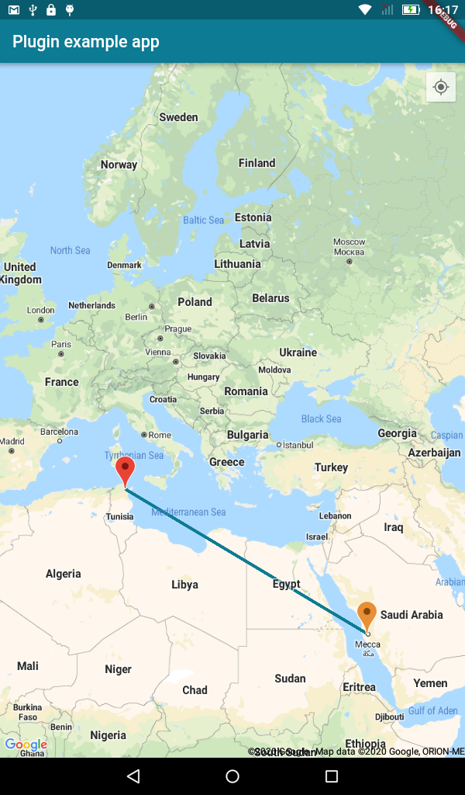

# Flutter Qiblah

Flutter Qiblah is a plugin that allows you to display Qiblah direction in you app with support for both Android and iOS.

## Getting Started

This plugin depends on both [geolocator](https://pub.dev/packages/geolocator) and [flutter_compass](https://pub.dev/packages/flutter_compass). 

## Setup

### iOS
Make sure to add keys with appropriate descriptions to the `Info.plist` file.

* `<key>NSLocationAlwaysUsageDescription</key>`

  `<string>This app needs access to location when in the background.</string>`
  
*  `<key>NSLocationAlwaysAndWhenInUseUsageDescription</key>`

   `<string>This app needs access to location when open and in the background.</string>`


### Android
Make sure to add permissions to the `app/src/main/AndroidManifest.xml` file.

* `android.permission.INTERNET`
* `android.permission.ACCESS_COARSE_LOCATIO`
* `android.permission.ACCESS_FINE_LOCATION`

## Features

* Check Device Sensor support (Android)
* Request Location permission
* Check GPS Status (Enabled and permission status)
* Receive Qiblah direction, North direction and Qiblah offset from North

## API

Check the device sensor support. 
For Android, a check will be made to determine whether the device contains `Sensor.TYPE_ROTATION_VECTOR` and return `true` else `false`. 
In iOS, will directly return `true`. 

```dart
import 'package:flutter_qiblah/flutter_qiblah.dart';
final _deviceSupport = await FlutterQiblah.androidDeviceSensorSupport();
```

Request GPS Location permission

```dart
import 'package:flutter_qiblah/flutter_qiblah.dart';
await FlutterQiblah.requestPermission();
```

Check GPS Location Status. Contains 

* `bool enabled`  
* `GeolocationStatus status {GeolocationStatus.granted, GeolocationStatus.denied, GeolocationStatus.disabled, GeolocationStatus.unknown}`

```dart
import 'package:flutter_qiblah/flutter_qiblah.dart';
final locationStatus = await FlutterQiblah.checkLocationStatus();
```

Qiblah Stream, returns a stream of QiblahDirection, containing: 

* `double qiblah`: The direction of Qiblah from North
* `double direction`: The direction of North
* `double offset`: The offset of Qiblah from North

```dart
import 'package:flutter_qiblah/flutter_qiblah.dart';
final _stream = FlutterQiblah.qiblahStream;
```

## Screens

Here is the Example app demo:


Based on the LocationStatus class, you can add a check to see the current status of the GPS and display an error widget if it's disabled or permission is denied. 
check the :memo: [Example Code](https://github.com/medyas/flutter_qiblah/tree/master/example/)


For devices with no sensors, a Map can be displayed with the direction from the current/selected location to Mecca. 
check the :memo: [Example Code](https://github.com/medyas/flutter_qiblah/tree/master/example/)


